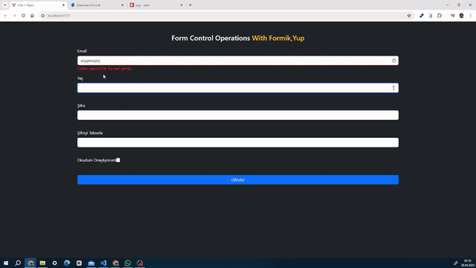

### Form Control Operations With Formik 

# Kullanılan Kütüphaneler
- bootstrap
- formik
- yup

- Form işlemleri, web geliştiricilerin sıklıkla karşılaştığı karmaşık bir alan olabilir. Ancak, Formik ve Yup gibi araçlar sayesinde bu süreç artık kolay ve düzenli hale geldi. Formik, form işlemlerini yönetmek için geliştirilmiş bir React kütüphanesidir. Yup ise şemaları tanımlamak ve doğrulamak için kullanılan bir şema validasyon kütüphanesidir. Bu güçlü ikiliyi bir araya getirdiğinizde, form geliştirme sürecinizin ne kadar verimli hale geldiğine inanamayacaksınız.

## Neden Formik ve Yup?

- Form işlemlerini deneyimlemek ve bu güçlü araçların nasıl birleştirildiğini görmek için  geliştirdim. Bu uygulamada, bir kullanıcı formu oluşturarak Formik'in gücünü ve Yup'un doğrulama özelliklerini keşfedebilirsiniz. Kullanıcıların ad, soyad, e-posta ve şifre bilgilerini girmesini sağlayan bir form tasarladım ve bu bilgilerin doğru formatta girilip girilmediğini ve regex koşulu sağlıyormu diye yup ile  doğruladık. Böylece, formunuzun her zaman doğru ve güvenli verilerle doldurulmasını sağlayabilirsiniz.

## Sonuç:

Form işlemleri artık daha kolay ve düzenli hale geldi. Formik ve Yup, form geliştirme sürecinizi hızlandırırken aynı zamanda daha güvenli ve sağlam bir yapı oluşturmanıza olanak tanıdı. 

### Ekran Görüntüsü

